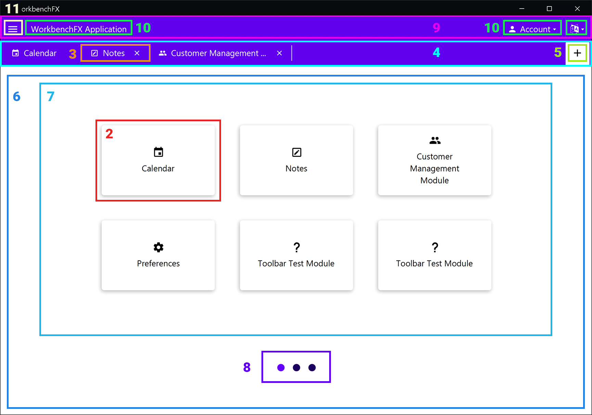
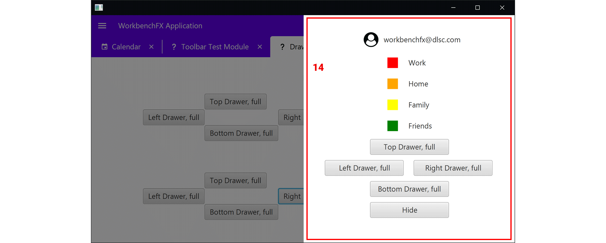
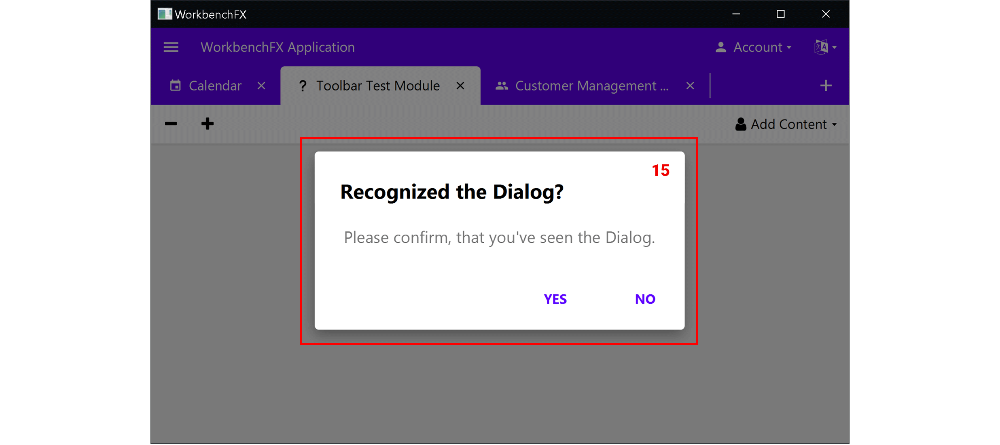

The most important components of *WorkbenchFX* are shown in the picutre above and the corresponding table below:

Nr. | Component           | Description
--- | ------------------- | -----------
 _  | `WorkbenchModule`   | A `Workbench` consists of multiple modules. It contains a title, an icon and the content to be displayed in it. It represents the *views* mentioned in chapter [What is WorkbenchFX?](#what-is-workbenchfx)
2  | `Tile`              | For each `WorkbenchModule` a `Tile` will be created. Clicking on the `Tile` opens the corresponding module
3  | `Tab`               | A `Tab` will be displayed for each open module. Clicking on a `Tab` opens and shows the view of the corresponding module. Pressing the *'x'* button closes the module
4  | Tab bar             | The upper section of the window, where the `Tab`s of the current open modules are displayed
5  | Add button          | The button used to open a new module. It opens an overview of all available modules
6  | `AddModulePage`     | Stores all the `Page`s on which the `Tile`s are displayed
7  | `Page`              | When more modules are loaded than defined in the `modulesPerPage()` attribute, the `Workbench` creates multiple `Page`s on which the `Tile`s are displayed
8  | Pagination dots     | Are only displayed when having multiple `Page`s and can be used for navigating through them
9  | Toolbar             | It contains `ToolbarItem`s. If the bar does not contain any items, the *toolbar* will be hidden automatically
10  | `ToolbarItem`       | Depending on the defined attributes, the item behaves like a JavaFX `Label`, `Button` or `MenuButton` (more about `ToolbarItem`s: [ToolbarItem](#toolbaritem))
11  | Menu button         | It opens the `NavigationDrawer`. The position of the button varies depending on the amount of items to be displayed in the *toolbar* and the `NavigationDrawer`. If the `NavigationDrawer` does not contain any items, the button will not be displayed at all. If any items are in the *toolbar*, it will be displayed on the left side of the *toolbar*, otherwise on the left side of the *tab bar*

Nr. | Component           | Description
--- | ------------------- | -----------
12  | `NavigationDrawer`  | It displays a *logo* which can be set in the stylesheet (described in chapter [Setting a Logo](#setting-a-logo)) and the defined `MenuItem`s. The default hover behavior over its items can be changed using the method call `navigationDrawer.setMenuHoverBehavior()`. It can be closed by clicking on the `GlassPane` or by pressing the back arrow button
13  | `GlassPane`         | The `GlassPane` prevents click events on the components below and adds a scrim to the background. Unless a blocking (modal) overlay is being displayed, clicking on the `GlassPane` closes the overlay (more about the *blocking* attribute: [Custom Overlay](#custom-overlay), [Custom Dialog](#custom-dialog))

Nr. | Component           | Description
--- | ------------------- | -----------
14  | `Drawer`            | It is possible to use `workbench.showDrawer()` to show drawers with custom content. All four sides of the window are supported (more about `Drawer`s: [Drawer](#drawer))

Nr. | Component           | Description
--- | ------------------- | -----------
15  | `DialogControl`     | Dialogs can be shown using a variety of predefined dialog types like `showInformationDialog()`, `showErrorDialog`, etc. Calling `workbench.showDialog(WorkbenchDialog)` shows a custom dialog (more about dialogs: [Dialog](#dialog))

Nr. | Component           | Description
--- | ------------------- | -----------
16  | `Module toolbar`    | Displays the module's toolbar items ([Workbench Module](#workbenchmodule)). The toolbar will automatically be shown as soon as there are items to be displayed and it will be hidden when there are none

